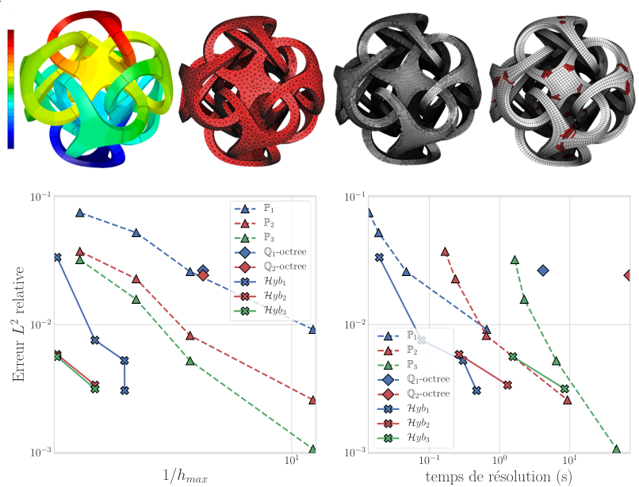
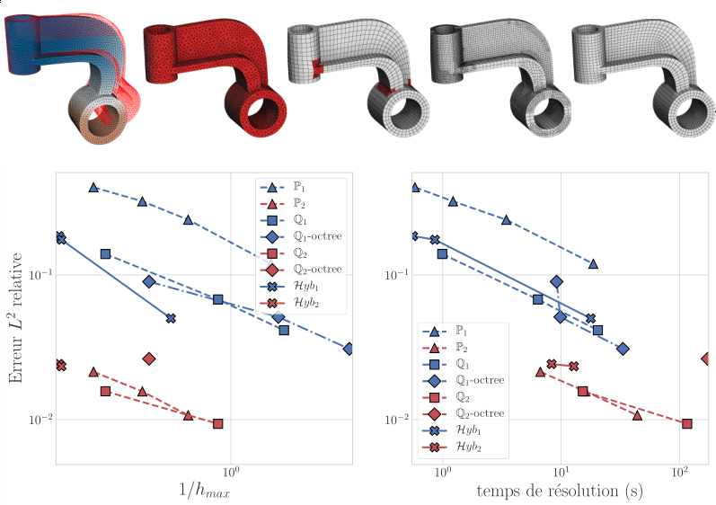

FFES: Fast Finite Element Sampling, a program to compute distances between
      finite element fields defined on different meshes, based on GPU regular
      sampling (via OpenGL)

This program/code is associated to the paper ``Reberol M., Lévy B., Computing
the distance between two finite element solutions defined on different 3D
meshes on a GPU, SIAM Journal on Scientific Computing, 2018``[(preprint
link)](https://hal.inria.fr/hal-01634176).

# Motivations

This is an efficient program to compare numerical simulations computed with
different meshes, different finite elements or even different codes.  For
example, this allows to produce the following comparisons between the
performance of hexahedral, tetrahedral and hexa-tetrahedral (hex-dominant)
meshes with Lagrange finite elements of order one, two and three.

- Error L2 (distance to reference solution) with the refinement (h_max) and
the solver time (BoomerAMG from the hypre library), for a Poisson problem
(Dirichlet on bottom and Neumann on top):

- Error L2 (distance to reference solution) with the refinement (h_max) and
the solver time (BoomerAMG from the hypre library), for a linear elasticity problem
(Dirichlet on left and Neumann on right cylinder):

(source: numerical experiments in the author PhD thesis)

# Requirements 

This program requires OpenGL 4.2. (not available on MacOS).

Tested on Linux (Ubuntu, Debian, Arch) with the Nvidia GTX680, GTX1080 graphics
cards and recent Nvidia drivers.

Earlier versions have been tested on Windows 10. The current version should
work, but maybe small changes are required.

# Installation

Using cmake and make:

    mkdir build
    cd build
    cmake ..
    make -j

To use the debug build: cmake -DCMAKE_BUILD_TYPE=Debug ..

If you have issues compiling the program, you can contact the authors and they will
gladly try to help you (see Contact section at the end).

# Usage

Executables are in the build folder.  For detailed parameter description, see
the program arguments with "ffes-distance -h". Basic syntax is:

    ffes-distance <path/to/fieldA.json> <path/to/fieldB.json> samples=<nb samples> 

Working examples (if launched in the build folder):

    ffes-distance 

For more command line examples, refer to the file `data/examples.txt`

The file format used to specify the field inputs is described in the file
INPUT_FORMAT.md.  For the moment, only a custom .json file format is supported.
It is possible to convert the output of the MFEM library (mesh in .mesh and
solution in .gf format) to the .json format using the executable
"convert-from-mfem" (requires to link with the serial MFEM library, see the
Dependencies section).

For correct usage, please read the associated paper which details the
algorithm limitations and the sensitivity to the parameters.

# Project organization

    src/ffes/           source code of algorithms
    src/bin/            source code of executables
    src/shaders/        source code of OpenGL shaders, copied to build directory by make
    third_party/        source code of third parties
    data/               data for test and examples
    CMakeLists.txt      CMake configuration

To explore the source code, a good starting point is the "Slicing loop" part of
the main() function in the file src/bin/compute_distance.cpp.

Implementation of the mapping and the interpolation functions (executed in the
OpenGL shaders) is the responsability of the user. They have to be provided 
(as string variables) in the input file. Example of such function generation (for Lagrange finite
elements) is available in the file `src/bin/convert_from_mfem.cpp`.

# Code limitations

- Field dimension is limited to 4 (because largest texture format is GL_RGBA).
  If you want to use higher vector field dimension, you need to implement
  multiple target rendering.
- Input data (mesh and field) have single floating point precision. It is
  possible to add support for double precision with small changes in the source
  code, but the rasterization will still be single precision because it is done
  automatically by OpenGL.

# Customization

To add a new finite element (also called element group, i.e. a chunk of data with the same mapping and local interpolation functions), you need to:
- specify the reference element decomposition into tetrahedra in the file `src/ffes/decompositions.hpp`
- specify the mapping function in the input file (see INPUT_FORMAT.md)
- specify the interpolation function in the input file (see INPUT_FORMAT.md)

# Optional

- The executable "convert-from-mfem" converts a mfem::Mesh and a mfem::GridFunction to
  a FieldObject format readable by this program. To build it, it is required to:
  - download and build mfem (see instructions at http://mfem.org)
  - create a symbolic link named 'mfem' in third_party/ folder which links to the mfem directory

# Third-party libraries

This program uses third-party libraries that are distributed under their own terms:
- MFEM (LGPL)
    homepage: http://mfem.org/
    files: 
        ./src/ffes/shader_functions.cpp (include modified functions from the MFEM library)
        ./src/bin/convert_from_mfem.cpp (link to the MFEM library if downloaded by the user)
- geogram_basic: parts of the Geogram library (3-clauses BSD license)
    homepage: http://alice.loria.fr/software/geogram/doc/html/index.html
- gl3w (public domain)
    homepage: https://github.com/skaslev/gl3w
- glm, OpenGL Mathematics (modified MIT license)
    homepage: http://glm.g-truc.net/
- glsw, The OpenGL Shader Wrangler (MIT license)
    homepage: http://prideout.net/blog/?p=11
- ImGui (MIT license)
    homepage: https://github.com/ocornut/imgui
- C++ Bitmap Library (Common Public License)
    homepage: http://www.partow.net/programming/bitmap/index.html
- nlohmann/json (MIT license)
    homepage: https://github.com/nlohmann/json

# License

See the COPYING file.

